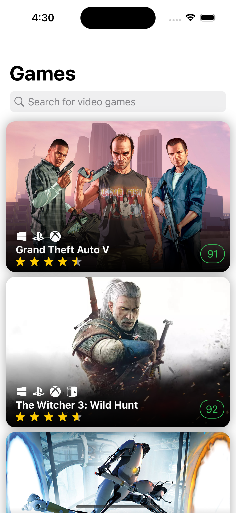
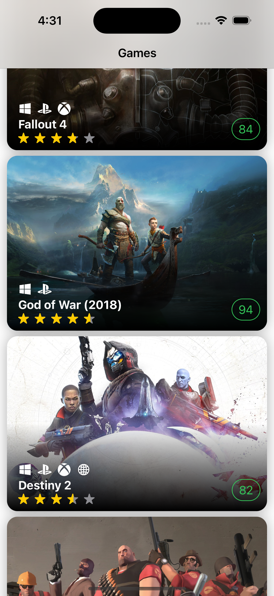
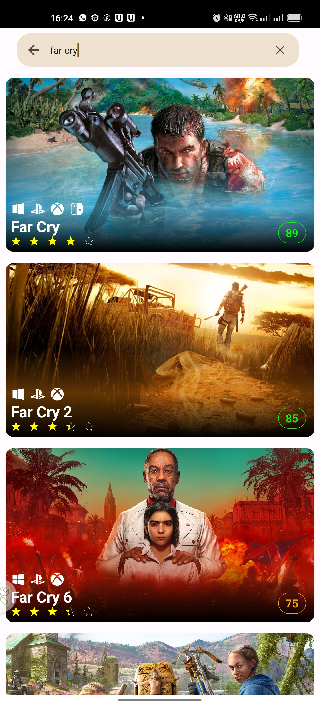

<h1 align="center"> Gamepedia WIP</h1>  

##  🤖 Introduction

A Game wiki App Powered by the [Raw G Api](https://rawg.io/)  implemented in  Kotlin Multiplatform Mobile, Jetpack Compose, and SwiftUI
The project includes a shared kotlin module which holds the networking layer responsible for querying data from the RAWG api, It also includes a common pagination functionality which is then consumed by the SwiftUI and Jetpack Compose applications.

- [Introduction](#introduction)
- [Features](#features)
- [Installation](#installation)
- [Screenshot](#screenshots)
- [Libraries](#tools)
##  Whats Working

A few things you can currently do with GamePedia:
* View Popular VideoGames
* Search for any VideoGame

##  🚗 Installation
- You need to use at least Android Studio Dolphin (**note: Java 11 is now the minimum version required**). Requires XCode 13.2 or later (due to use of new Swift 5.5 concurrency APIs).
- Follow the [KMM Guide by Jetbrains](https://kotlinlang.org/docs/kmm-overview.html) for getting started building a project with KMM.
- Install Kotlin Multiplatform Mobile plugin in Android Studio
- Clone or download the repo
- Get your API Key from https://rawg.io/ and append it in the API-Key file 
- Rebuild Project
- When opening iOS project remember to open `.xcworkspace` file (and not `.xcodeproj` one). 

##  Screenshots

**iOS (SwiftUI)**
<table>
  <tr>
    <td></td>
    <td></td>
    <td></td>
  </tr>
</table>

**Android (Jetpack Compose)**
<table>
  <tr>
    <td></td>
    <td></td>
    <td></td>
  </tr>
</table>

##  Languages, libraries and tools used
* [Kotlin](https://kotlinlang.org/)
* [Kotlin Coroutines](https://kotlinlang.org/docs/reference/coroutines-overview.html)
* [Kotlinx Serialization](https://github.com/Kotlin/kotlinx.serialization)
* [Ktor client library](https://github.com/ktorio/ktor)
* [Android Architecture Components](https://developer.android.com/topic/libraries/architecture/index.html)
* [Koin](https://github.com/InsertKoinIO/koin)
* [Jetpack Compose](https://developer.android.com/jetpack/compose)
* [SwiftUI](https://developer.apple.com/documentation/swiftui)
* [Multiplatform Paging](https://github.com/kuuuurt/multiplatform-paging)